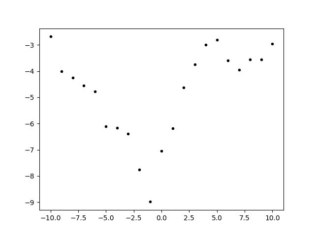
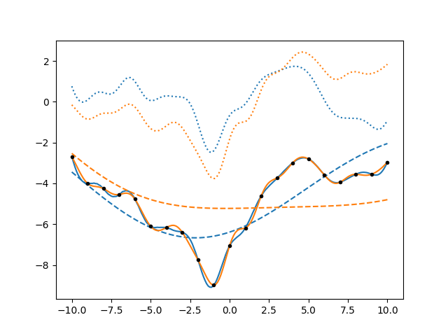
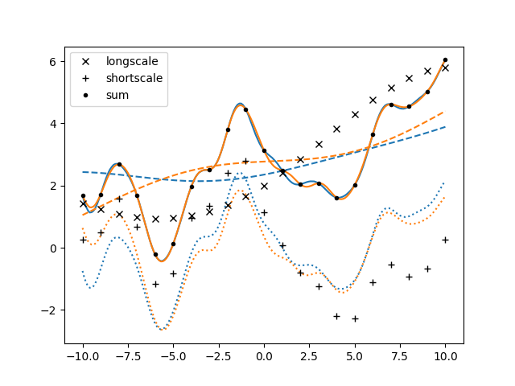

.. lsqfitgp/docs/components.rst
..
.. Copyright (c) 2020, 2022, Giacomo Petrillo
..
.. This file is part of lsqfitgp.
..
.. lsqfitgp is free software: you can redistribute it and/or modify
.. it under the terms of the GNU General Public License as published by
.. the Free Software Foundation, either version 3 of the License, or
.. (at your option) any later version.
..
.. lsqfitgp is distributed in the hope that it will be useful,
.. but WITHOUT ANY WARRANTY; without even the implied warranty of
.. MERCHANTABILITY or FITNESS FOR A PARTICULAR PURPOSE.  See the
.. GNU General Public License for more details.
..
.. You should have received a copy of the GNU General Public License
.. along with lsqfitgp.  If not, see <http://www.gnu.org/licenses/>.

.. currentmodule:: lsqfitgp

.. _components:

Splitting components
====================

In :ref:`kernelexpl` we saw an example where we summed two :class:`ExpQuad`
kernels with different scale, and the result effectively looked like the sum
of two processes, because the kernel of a sum of processes is the sum of their
kernels.

When summing processes it is useful to get the fit result separately for each
component. In :mod:`lsqfitgp` there's not a specific tool for this because it
can be implemented using kernel tricks, multidimensional input and
transformations.

Let's see. We first generate some data::

    import numpy as np
    import lsqfitgp as lgp
    import gvar
    from matplotlib import pyplot as plt
    
    gp = lgp.GP(10 * lgp.ExpQuad(scale=10) + lgp.ExpQuad(scale=1))
    
    x = np.linspace(-10, 10, 21)
    gp.addx(x, 'pinguini')
    
    prior = gp.prior('pinguini')
    y = next(gvar.raniter(prior))
    
    fig = plt.figure('lsqfitgp example')
    fig.clf()
    ax = fig.subplots(1, 1)
    
    ax.plot(x, y, '.k')
    
    fig.savefig('components1.png')

We made a mixture of two exponential quadratic and took a sample from the prior
as data. Generating fake data from the prior is a good way to make sure that
the fit will make sense with the data.

Now we setup a fit with an additional integer input dimension that indicates
the component::

    xcomp = np.empty((2, len(x)), dtype=[
        ('x', float),
        ('comp', int)
    ])
    xcomp['x'] = x  # broadcasting aligns the last axes
    xcomp['comp'] = np.array([0, 1])[:, None]

We need to make a kernel that changes based on the value in the ``'comp'``
field. We can do that by using a :class:`Rescaling` that acts on ``'comp'``::

    kernel1 = 10 * lgp.ExpQuad(scale=10)
    kernel2 = lgp.ExpQuad(scale=1)
    
    kernel = kernel1 * lgp.Rescaling(stdfun=lambda x: x['comp'] == 0)
    kernel += kernel2 * lgp.Rescaling(stdfun=lambda x: x['comp'] == 1)
    
    gp = lgp.GP(kernel)

The boolean operation in the `stdfun` argument returns 0 or 1, and since
`stdfun` is called on both arguments of the kernel, each component is nonzero
only when acting on two points which have the same ``'comp'``.

Now we add separately the two components and sum them with
:meth:`~GP.addtransf`::

    gp.addx(xcomp[0], 'longscale')
    gp.addx(xcomp[1], 'shortscale')
    gp.addtransf({'shortscale': 1, 'longscale': 1}, 'sum')

We can now proceed as usual to get the posterior on other points::

    xplot = np.empty((2, 200), dtype=xcomp.dtype)
    xplot['x'] = np.linspace(-10, 10, xplot.shape[1])
    xplot['comp'] = np.array([0, 1])[:, None]
    
    gp.addx(xplot[0], 'longscale_plot')
    gp.addx(xplot[1], 'shortscale_plot')
    gp.addtransf({'longscale_plot': 1, 'shortscale_plot': 1}, 'sum_plot')
    
    post = gp.predfromdata({'sum': y})
    
    ax.cla()
    
    for sample in gvar.raniter(post, 2):
        line, = ax.plot(xplot[0]['x'], sample['sum_plot'])
        color = line.get_color()
        ax.plot(xplot[0]['x'], sample['longscale_plot'], '--', color=color)
        ax.plot(xplot[0]['x'], sample['shortscale_plot'], ':', color=color)
    
    ax.plot(x, y, '.k')
    
    fig.savefig('components2.png')

It's interesting to note that the uncertainty on the individual components is
larger than the uncertainty on the total, because there are various possible
combinations that give the same data.

Writing this code was a bit tedious, I had to use :class:`Rescaling` for each
kernel component, make a structured array and add separately the components,
and then redo it again for the plotting points. I'll now rewrite the code in a
tidier way by defining a function and using :func:`where`. This time I'll also
generate data separately for each component, although the fit will be done only
on the sum as before::

    kernel = lgp.where(lambda x: x['comp'] == 0, kernel1, kernel2)
    gp = lgp.GP(kernel)
    
    keys = ['longscale', 'shortscale', 'sum']
    
    def addxcomp(x, basekey):
        xcomp = np.empty((2, len(x)), dtype=[('x', float), ('comp', int)])
        xcomp['x'] = x
        xcomp['comp'] = np.arange(2)[:, None]
        gp.addx(xcomp[0], basekey + keys[0])
        gp.addx(xcomp[1], basekey + keys[1])
        gp.addtransf({
            basekey + keys[0]: 1,
            basekey + keys[1]: 1
        }, basekey + keys[2])
    
    x = np.linspace(-10, 10, 21)
    xplot = np.linspace(-10, 10, 200)
    
    addxcomp(x, 'data')
    addxcomp(xplot, 'plot')
    
    dataprior = gp.prior(['data' + k for k in keys])
    y = next(gvar.raniter(dataprior))
    
    post = gp.predfromdata({
        'datasum': y['datasum']
    }, ['plot' + k for k in keys])
    
    ax.cla()
    
    for sample in gvar.raniter(post, 2):
        line, = ax.plot(xplot, sample['plotsum'])
        color = line.get_color()
        ax.plot(xplot, sample['plotlongscale'], '--', color=color)
        ax.plot(xplot, sample['plotshortscale'], ':', color=color)
    
    for marker, key in zip(['x', '+', '.'], keys):
        ax.plot(x, y['data' + key], color='black', marker=marker, label=key, linestyle='')
    ax.legend()
    
    fig.savefig('components3.png')

