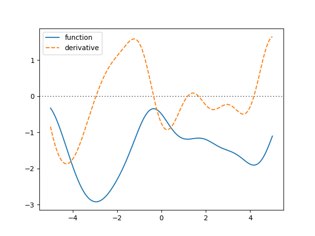
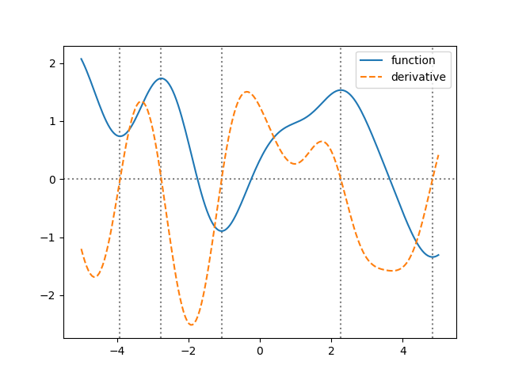
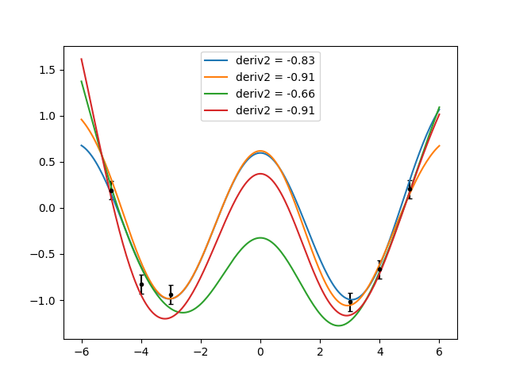

.. lsqfitgp/docs/derivatives.rst
..
.. Copyright (c) 2020, 2022, Giacomo Petrillo
..
.. This file is part of lsqfitgp.
..
.. lsqfitgp is free software: you can redistribute it and/or modify
.. it under the terms of the GNU General Public License as published by
.. the Free Software Foundation, either version 3 of the License, or
.. (at your option) any later version.
..
.. lsqfitgp is distributed in the hope that it will be useful,
.. but WITHOUT ANY WARRANTY; without even the implied warranty of
.. MERCHANTABILITY or FITNESS FOR A PARTICULAR PURPOSE.  See the
.. GNU General Public License for more details.
..
.. You should have received a copy of the GNU General Public License
.. along with lsqfitgp.  If not, see <http://www.gnu.org/licenses/>.

.. currentmodule:: lsqfitgp

.. _derivs:

Taking derivatives
==================

The kernel of a derivative is just the derivative of the kernel:

.. math::
    \operatorname{Cov}[f'(x), f'(y)]
    &= \frac \partial {\partial x} \frac \partial {\partial y}
       \operatorname{Cov}[f(x), f(y)] = \\
    &= \frac \partial {\partial x} \frac \partial {\partial y} k(x, y).

With :mod:`lsqfitgp` it's easy to use derivatives of functions in fits (the
automatic derivative calculations are implemented with `autograd
<https://github.com/HIPS/autograd>`_). Let's just dive into the code::

    import lsqfitgp as lgp
    import numpy as np
    import gvar
    
    gp = lgp.GP(lgp.ExpQuad())
    x = np.linspace(-5, 5, 200)
    gp.addx(x, 'foo')
    gp.addx(x, 'bar', deriv=1)

We just said ``deriv=1`` to :meth:`~GP.addx`, easy as that. Let's plot a sample
from the prior::

    from matplotlib import pyplot as plt
    
    fig, ax = plt.subplots(num='lsqfitgp example')
    
    y = gp.prior()
    sample = next(gvar.raniter(y))
    
    ax.plot(x, sample['foo'], label='function')
    ax.plot(x, sample['bar'], label='derivative', linestyle='--')
    ax.axhline(0, linestyle=':', color='gray', zorder=-1)
    
    ax.legend()
    
    fig.savefig('derivatives1.png')

This time we used :meth:`~GP.prior` without arguments, i.e., we did not specify
if we wanted ``'foo'`` or ``'bar'``. If you print ``sample``, you will see it
is a dictionary-like object, a :class:`gvar.BufferDict`::

    print(repr(sample))

Output::

   BufferDict([('foo', array([-3.64653765e-01, -3.23953952e-01, -2.82800970e-01, -2.41572117e-01,
       -2.00706893e-01, -1.60677780e-01, -1.21912123e-01, -8.49858459e-02,
    [...]
       -1.26686658e-01, -1.08753542e-01, -9.11791067e-02, -7.39771797e-02,
       -5.72100107e-02, -4.08530974e-02, -2.48040154e-02, -8.98723986e-03])),
    ('bar', array([ 0.80291661,  0.81567938,  0.82096587,  0.81818041,  0.80666123,
        0.78573645,  0.75479056,  0.7133369 ,  0.66094777,  0.59746258,
    [...]
        0.36215257,  0.36271008,  0.35954951,  0.35369713,  0.34610696,
        0.33774402,  0.32955189,  0.32229015,  0.31659095,  0.31293504]))])

In general :mod:`gvar`, and so also :mod:`lsqfitgp`, can work with arrays or
dictionaries of arrays/scalars. This comes in handy to carry around all the
numbers in one object without forgetting the names of the things.

Looking at the plot, the points where the derivative is zero seem to
correspond to minima/maxima of the function. Let's check this more accurately::

    condition = np.diff(np.sign(sample['bar'])) != 0
    xcenter = 1/2 * (x[1:] + x[:-1])
    zeros = xcenter[condition]
    
    for zero in zeros:
        ax.axvline(zero, linestyle=':', color='gray', zorder=-1)
    
    fig.savefig('derivatives2.png')

It works! The prior "knows" that one line is the derivative of the other just
by using the correlations.

For a more realistic example, we will add data. Imagine you have some
datapoints, and that you also know that at a certain point the function has a
maximum. You don't know its value, but you know it must have a maximum. In
terms of derivatives, a maximum is given by a zero first derivative and a
negative second derivative. It won't be complicated. I will stop using *foo*
and *bar* and give meaningful names to the points::

    x = np.array([-5, -4, -3, 3, 4, 5])
    yerr = 0.1
    y = np.cos(x) # we got bored of sines already
    y += yerr * np.random.randn(len(x))
    y = gvar.gvar(y, yerr * np.ones(len(x)))
    
    gp = lgp.GP(lgp.ExpQuad(scale=2))
    gp.addx(x, 'data')
    gp.addx(0, 'maximum-slope', deriv=1) # the cosine maximum is in 0
    gp.addx(0, 'maximum-curvature', deriv=2)
    
    xplot = np.linspace(-6, 6, 200)
    gp.addx(xplot, 'plot')
    
    given = {
        'data': y,  
        'maximum-slope': 0, # exactly zero
        'maximum-curvature': gvar.gvar(-1, 0.3) # -1 ± 0.3
    }
    
    ypost = gp.predfromdata(given)
    
    ax.cla()
    
    ax.errorbar(x, gvar.mean(y), yerr=gvar.sdev(y), fmt='.k', capsize=2)
    for sample in gvar.raniter(ypost, 4):
        deriv2 = sample['maximum-curvature']
        ax.plot(xplot, sample['plot'], label='deriv2 = {:.2f}'.format(deriv2))
    
    ax.legend()
    
    fig.savefig('derivatives3.png')

Very good! However, I'm cheating. I modified the ``scale`` parameter until
I found that ``scale=2`` would give something similar to a cosine. Try to guess
what happens if you change the scale, and then try modifying it.
