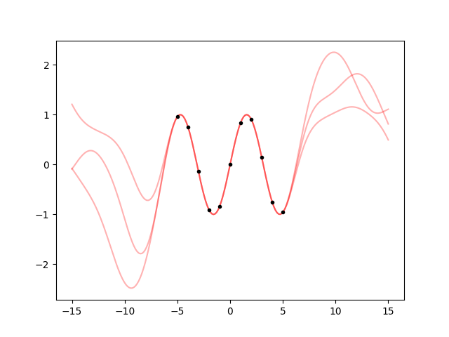
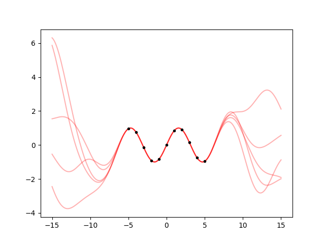
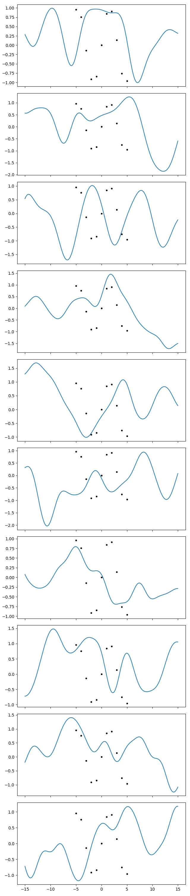
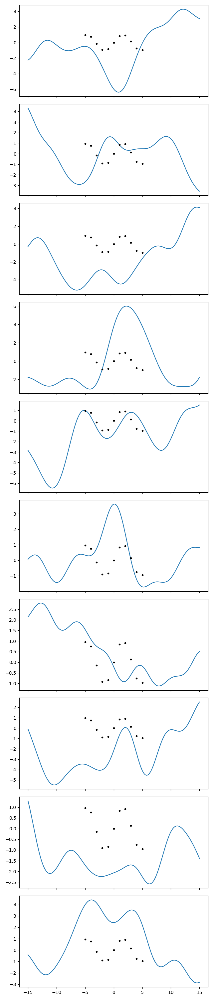
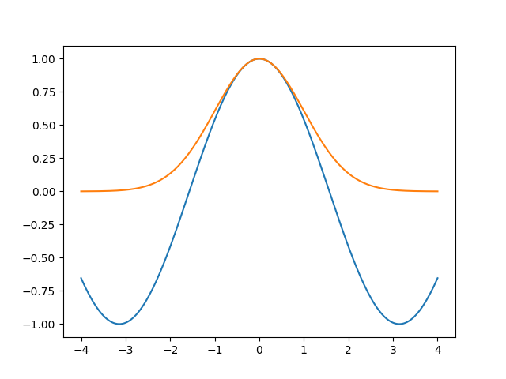
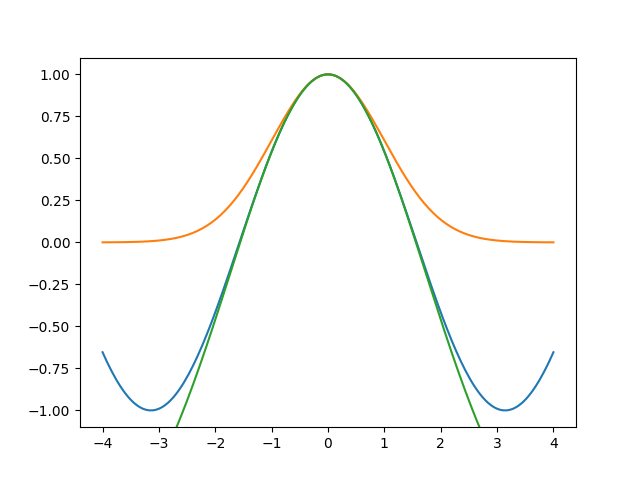
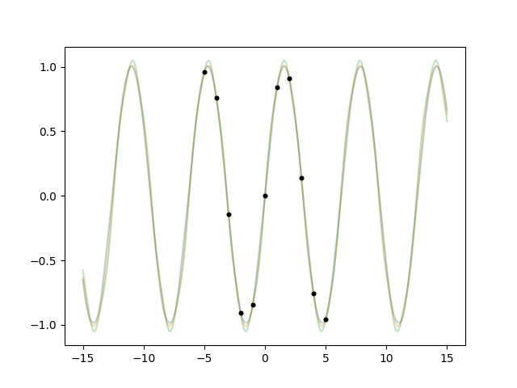

.. currentmodule:: lsqfitgp

.. _hyper:

Hyperparameters
===============

In the previous examples we often had to tweak the `scale` parameter of the
kernel to make it work. Whenever you're tweaking a parameter, it would be nice
if the tweaking was done automatically. I would add: it would be nice to get
a statistical uncertainty on the optimal parameter value.

It is not possible to use what we have seen up to now to fit the `scale`
parameter, because that parameter goes into the definition of the kernel, and
the kernel completely specifies the gaussian process. A different scale would
mean a different kernel and so a different gaussian process.

This kind of parameters that reside on a "higher" level and can not be fitted
are called *hyperparameters*. In this context the "normal" parameters are the
values of the gaussian process on the points you ask for them with
:meth:`GP.predfromdata`.

From a statistical point of view there's no difference between parameters and
hyperparameters, it is a practical categorization that comes up when the
particular statistical tool you are using can not fit everything (our case), or
because it's something that you do not want to fit, or it is something that you
want to call parameters but you already called parameters something else so you
need another fancy name.

Enough chatter already, let's fit this damn `scale` parameter::

    import numpy as np
    import lsqfitgp as lgp
    import gvar
    
    x = np.linspace(-5, 5, 11)
    y = np.sin(x)
    def makegp(hyperparams):
        gp = lgp.GP(lgp.ExpQuad(scale=hyperparams['scale']))
        gp.addx(x, 'sine')
        return gp
    hyperprior = {'log(scale)': gvar.log(gvar.gvar(3, 3))}
    hp = lgp.empbayes_fit(hyperprior, makegp, {'sine': y})
    print(hp['scale'])

Output::

   2.16(17)

As usual, it's easier done than said! The code is short but introduces a bunch
of new things, let's go through it. 

First, we encapsulated creating the :class:`GP` object and adding points in
the function :func:`makegp`, that takes as sole argument a dictionary of
hyperparameters.

Then we specified a "hyperprior" for the hyperparameters (if you want to fit
something you need a prior on it, there's no way out of this). The function
:func:`makegp` extracts a key ``'scale'`` from the dictionary, but in the
hyperprior we used ``'log(scale)'``. This is a general feature of :mod:`gvar`,
that it can automatically apply the inverse of the transformation specified in
the key. It doesn't magically work with any function, by default only the
logarithm is supported, you can add other functions with
:meth:`gvar.BufferDict.add_distribution`.

This means that the parameter we are actually fitting is the logarithm of the
scale. Something like this is necessary because the scale must be a positive
number: if we put ``'scale'`` in the hyperprior, the fitting routine would
explore negative values too, and we would get a loud error from :class:`Kernel`.

Finally, we give everything to the function :func:`empbayes_fit`: the
hyperprior, the gp-creating function, and a dictionary of data like we would
pass to :meth:`~GP.predfromdata`. The returned dictionary is the fit result
for the hyperparameters.

Now that we have found the optimal scale, we can use it to create a gp object
and take some samples. However, since the hyperparameter has an uncertainty,
we have to sample it too::

    from matplotlib import pyplot as plt
    
    fig = plt.figure('lsqfitgp example')
    fig.clf()
    ax = fig.subplots(1, 1)
    
    xplot = np.linspace(-15, 15, 200)
    
    for hpsample in gvar.raniter(hp, 3):
        gp = makegp(hpsample)
        gp.addx(xplot, 'plot')
        yplot = gp.predfromdata({'sine': y}, 'plot')
        
        for ysample in gvar.raniter(yplot, 1):
            ax.plot(xplot, ysample, color='red', alpha=0.3)
    
    ax.plot(x, y, '.k')
    
    fig.savefig('hyper1.png')

Cool. But I find the oscillations quite too high going away from the data. Can
we change that with an hyperparameter? The amplitude of the oscillations is
given by the prior variance, so we just need to multiply the kernel by a
constant::

    def makegp(hyperparams):
        variance = hyperparams['sdev'] ** 2
        scale = hyperparams['scale']
        kernel = lgp.ExpQuad(scale=scale) * variance
        gp = lgp.GP(kernel)
        gp.addx(x, 'sine')
        return gp
    
    hyperprior = {
        'log(sdev)': gvar.log(gvar.gvar(1, 1)),
        'log(scale)': gvar.log(gvar.gvar(3, 3))
    }
    
    hp = lgp.empbayes_fit(hyperprior, makegp, {'sine': y})
    print('sdev', hp['sdev'])
    print('scale', hp['scale'])

.. warning::

   I did ``lgp.ExpQuad(scale=scale) * variance`` instead of ``variance *
   lgp.ExpQuad(scale=scale)``. The latter would fail due to a bug. When using
   :func:`empbayes_fit`, Kernel-scalar operations have to be done with the
   Kernel on the left.

Output::

   sdev 2.44(81)
   scale 2.86(22)

It did not do what I wanted! The fitted standard deviation is even higher
than 1. ::

    ax.cla()
    
    for hpsample in gvar.raniter(hp, 5):
        gp = makegp(hpsample)
        gp.addx(xplot, 'plot')
        yplot = gp.predfromdata({'sine': y}, 'plot')
        
        for ysample in gvar.raniter(yplot, 1):
            ax.plot(xplot, ysample, color='red', alpha=0.3)
    
    ax.plot(x, y, '.k')
    
    fig.savefig('hyper2.png')

I *hate* it when the fit does not give the *right* result. Ok, let's calm down,
math does not lie. If this is the result, and I think it's wrong, then my
assumptions are wrong. What are my assumptions? Well, I know it's a sine, but I
did't tell this to the fit. I told it that the kernel is an exponential
quadratic. The fit is trying to find a scale and variance such that it becomes
as likely as possible to see a sine-like oscillation 10 units long with an
exponential quadratic correlation.

So we should deduce that such an oscillation tipically comes out as a small
oscillation in a more widely varying function. To get a feel of that, let's
plot a lot of samples from the prior with the hyperparameters I would have
liked to come out, i.e. I'll use a scale of 2 and a standard deviation of, say,
0.7::

    gp = makegp({'scale': 2, 'sdev': 0.7})
    gp.addx(xplot, 'plot')
    
    prior = gp.prior('plot')
    
    fig.clf()
    fig.set_size_inches(6.4, 30)
    axs = fig.subplots(10, 1, sharex=True)
        
    for ax, sample in zip(axs, gvar.raniter(prior)):
        ax.plot(xplot, sample)
        ax.plot(x, y, '.k')
    
    fig.tight_layout()
    fig.savefig('hyper3.png')

Now we do the same with the optimized hyperparameters::

    gp = makegp(gvar.mean(hp))
    gp.addx(xplot, 'plot')
    
    prior = gp.prior('plot')
    
    for ax, sample in zip(axs, gvar.raniter(prior)):
        ax.cla()
        ax.plot(xplot, sample)
        ax.plot(x, y, '.k')
    
    fig.savefig('hyper4.png')

In the first series of plots I see 2-3 curves that do something similar to the
datapoints. I can find 2-3 in the second series too. So ok, I acknowledge that
those points can likely come out even with a wider variance than I thought.
But I recall the fit saying ``sdev 2.44(81)``. This is :math:`2.4 \pm 0.8`, so
the uncertainty is a bit wide, but still 1 seems far from the mean. What
probability is the fit giving to sdev being less than 1? We can compute this by
integrating the gaussian distribution, with the caveat that the parameter we
actually used in the fit is log(sdev)::

    from scipy import stats
    
    p = hp['log(sdev)']
    prob = stats.norm.cdf(np.log(1), loc=gvar.mean(p), scale=gvar.sdev(p))
    print('{:.3g}'.format(prob))

Output::

   0.00383

Ouch, that's low. The fit values my intuition at less than 1 %. Now I'm
outraged, I'll show :mod:`lsqfitgp` that he's wrong and I'm right. I'll do a
proper bayesian fit with Markov Chains using :mod:`pymc3`. First, I print
the mean and standard deviations of the effective hyperparameters (the
logarithms)::

    for k, v in hp.items():
        print(k, v)

Output::

   log(sdev) 0.89(33)
   log(scale) 1.051(77)

Then I run this code to get the (I hope) correct and satisfying answer::

   import pymc3 as pm
   
   model = pm.Model()
   with model:
       logscale = pm.Normal('logscale', mu=np.log(3), sigma=1)
       logsdev = pm.Normal('logsdev', mu=np.log(1), sigma=1)
       kernel = pm.math.exp(logsdev) ** 2 * pm.gp.cov.ExpQuad(1, ls=pm.math.exp(logscale))
       gp = pm.gp.Marginal(cov_func=kernel)
       gp.marginal_likelihood('data', x[:, None], y, 0)
   
   with model:
       mp = pm.find_MAP()
       trace = pm.sample(10000, cores=1)
   
   print('\nMaximum a posteriori (must be the same as lsqfitgp):')
   print('log(sdev) {:.2f}'.format(mp['logsdev']))
   print('log(scale) {:.2f}'.format(mp['logscale']))
   
   df = pm.trace_to_dataframe(trace)
   mean = df.mean()
   cov = df.cov()
   
   meandict = {}
   covdict = {}
   for label1 in df.columns:
       meandict[label1] = mean[label1]
       for label2 in df.columns:
           covdict[label1, label2] = cov[label1][label2]
   
   params = gvar.gvar(meandict, covdict)
   print('\nPosterior mean and standard deviation:')
   print('log(sdev)', params['logsdev'])
   print('log(scale)', params['logscale'])
   
   p = params['logsdev']
   prob_gauss = stats.norm.cdf(np.log(1), loc=gvar.mean(p), scale=gvar.sdev(p))
   true_prob = np.sum(df['logsdev'] <= np.log(1)) / len(df)
   print('\nProbability of having sdev < 1:')
   print('prob_gauss {:.3g}'.format(prob_gauss))
   print('true_prob {:.3g}'.format(true_prob))

Output::

   logp = -108.32, ||grad|| = 2,021.1: 100%|█████████████████████████████████████████████████████████████████| 20/20 [00:00<00:00, 228.23it/s]
   Auto-assigning NUTS sampler...
   Initializing NUTS using jitter+adapt_diag...
   Sequential sampling (2 chains in 1 job)
   NUTS: [logsdev, logscale]
   Sampling chain 0, 0 divergences: 100%|███████████████████████████████████████████████████████████████| 10500/10500 [03:41<00:00, 47.38it/s]
   Sampling chain 1, 0 divergences: 100%|███████████████████████████████████████████████████████████████| 10500/10500 [03:37<00:00, 48.17it/s]
   The number of effective samples is smaller than 25% for some parameters.
   
   Maximum a posteriori (must be the same as lsqfitgp):
   log(sdev) 0.89
   log(scale) 1.05
   
   Posterior mean and standard deviation:
   log(sdev) 0.86(40)
   log(scale) 1.01(11)
   
   Probability of having sdev < 1:
   prob_gauss 0.0151
   true_prob 0.0165

So the correct mean and standard deviation for log(sdev) are :math:`0.86 \pm
0.40`, versus :mod:`lsqfitgp`'s result :math:`0.89 \pm 0.33`. The probability
of having sdev < 1 is 1.5 %, and by doing a more accurate computation that
keeps into account that the distribution is actually non-gaussian I manage to
get it to 1.6 %, four times as much as :mod:`lsqfitgp`'s answer, but still low.

What did we learn? First, that :func:`empbayes_fit` is not so accurate, it just
gives a reasonable estimate of the mean and covariance matrix of the posterior
for the hyperparameters. This is because it is much faster than, for example,
:mod:`pymc3` (tipically just starting up :mod:`pymc3` takes more time than
doing a fit with :mod:`lsqfitgp`). So, when computing sensitive quantities like
the probability of a tail of the distribution, the result can become quite
wrong.

Second, we learned that I was wrong and effectively it is not very likely,
with the exponential quadratic kernel, to get an harmonic oscillation with a
prior variance less than 1.

Is there a somewhat clear explanation of this? Yes there is! In
:ref:`kernelexpl`, we said that any kernel can be written as

.. math::
    k(x, y) = \sum_i h_i(x) h_i(y).

What are the :math:`h_i` for the exponential quadratic kernel? Well, first I
have to say that I'll actually do an integral instead of a summation, but
whatever. The solution is, guess what, gaussians:

.. math::
    h_\mu(x) &= \exp(-(x - \mu)^2), \\
    \int_{-\infty}^\infty \mathrm d\mu\,
    h_\mu(x) h_\mu(y) &=
    \int_{-\infty}^\infty \mathrm d\mu\,
    \exp(-2\mu^2 + 2\mu(x + y) - x^2 - y^2) = \\
    &= \int_{-\infty}^\infty \mathrm d\mu\,
    \exp\left(
    -2\left(\mu - \frac{x+y}2 \right)^2 + \frac {(x+y)^2} 2 - x^2 - y^2
    \right) = \\
    &= \sqrt{\frac\pi2} \exp\left(-\frac12 (x-y)^2 \right).

This means that the fit is trying to redraw the datapoints using a combination
of gaussians, so it will be happy when the datapoints are similar to a bunch of
gaussians, such that it doesn't have to figure out a nontrivial mixture of
many different gaussians that magically gives out precisely our points.

But isn't a sine similar to some gaussians, one up, one down, etc.? Apparently
so. Let's explore this impression by plotting a sine aligned with a gaussian.
To align them, I will put the maxima in the same point, and also make them have
the same second derivative::

    x = np.linspace(-4, 4, 200)
    cos = np.cos(x)
    gauss = np.exp(-1/2 * x**2)
    
    fig = plt.figure('cosgauss')
    fig.clf()
    ax = fig.subplots(1, 1)
    
    ax.plot(x, cos)
    ax.plot(x, gauss)
    
    fig.savefig('hyper5.png')

Ok. Can we get a better alignment? The fit wanted the gaussian to be higher
than the sine, so let's try it::

    gauss_large = 3 * np.exp(-1/2 * (x / np.sqrt(3)) ** 2) - 2
    ax.plot(x, gauss_large, scaley=False)
    
    fig.savefig('hyper6.png')

So the fit sees that a sine is more similar to the top of a high gaussian than
to a gaussian with the same height as the sine.

We learned a lesson. But now how do we make the fit work? Oh well that's as
easy as cheating actually if we use the :class:`Periodic` kernel::

    x = np.linspace(-5, 5, 11)
    
    def makegp(hp):
        scale = hp['period'] / (2 * np.pi)
        kernel = lgp.Periodic(scale=scale)
        gp = lgp.GP(kernel)
        gp.addx(x, 'sine')
        return gp
    
    hprior = {
        'log(period)': gvar.log(2 * np.pi * gvar.gvar(1, 1)),
    }
    hp = lgp.empbayes_fit(hprior, makegp, {'sine': y})
    for k, v in hp.items():
        print(k, v)
        wo_log = k[4:-1]
        print(wo_log, hp[wo_log])
    
    ax.cla()
    
    for hpsamp in gvar.raniter(hp, 3):
        gp = makegp(hpsamp)
        gp.addx(xplot, 'plot')
        yplot = gp.predfromdata({'sine': y}, 'plot')
        
        for ysamp in gvar.raniter(yplot, 1):
            ax.plot(xplot, ysamp, alpha=0.3)
        ax.plot(x, y, '.k')
    
    fig.savefig('hyper7.png')

Output::

   log(period) 1.8373(29)
   period 6.280(18)
