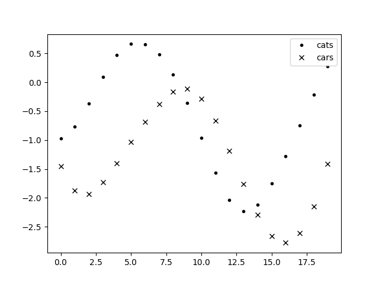
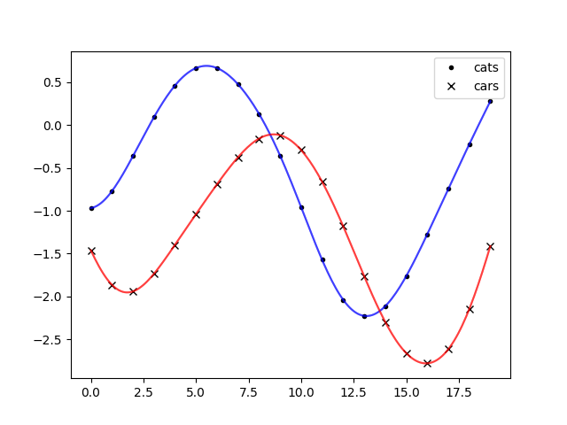

.. currentmodule:: lsqfitgp

.. _hyperstruct:

Hyperparameters in the input
============================

This section is a bit technical, I will just explain a workaround necessary to
make :func:`empbayes_fit` work when the hyperparameters enter in the definition
of the gaussian process from the input points instead of from the kernel
parameters and the input points are multidimensional.

Let's say you are investigating on a case of disappeared cats in a village. You
want to study the correlation between the number of new cars bought per day and
the number of reported disappeared cats per day.

To make it quick, I'll first write the model and then generate the fake data
from it for some value of the hyperparameters, then we'll check if the fit
recovers the correct hyperparameters. ::

    import numpy as np
    import gvar
    import lsqfitgp as lgp
    from matplotlib import pyplot as plt
    
    def makepoints(time):
        points = np.empty((2, len(time)), dtype=[
            ('time', float),
            ('series', int)  # 0 = cats, 1 = cars
        ])
        points['time'] = time
        points['series'] = np.arange(2)[:, None]
        return points
    
    time = np.arange(20)
    
    def makegp(hp):
        delay = hp['delay']
        corr = hp['corr']
        scale = hp['scale']
        
        kernel = lgp.ExpQuad(dim='time', scale=scale)
        cov = np.array([[1, corr], [corr, 1]])
        kernel *= lgp.Categorical(dim='series', cov=cov)
        
        gp = lgp.GP(kernel)
        
        points = makepoints(time)
        points['time'][0] -= delay
        gp.addx(points, 'data')
        
        return gp
    
    truehp = {
        'delay': 10,
        'corr': 0.70,
        'scale': 3
    }
    
    gp = makegp(truehp)
    prior = gp.prior('data')
    data = next(gvar.raniter(prior))
    
    fig = plt.figure('lsqfitgp example')
    fig.clf()
    ax = fig.subplots(1, 1)
    
    ax.plot(time, data[0], '.k', label='cats')
    ax.plot(time, data[1], 'xk', label='cars')
    ax.legend()
    
    fig.savefig('hyperstruct1.png')

You can see that cats seem to reproduce the trend of cars but with a delay.
Let's fit now::

    hprior = {
        'delay': gvar.gvar(10, 5),
        'func(corr)': gvar.BufferDict.uniform('func', -1, 1),
        'log(scale)': gvar.log(gvar.gvar(3, 1))
    }
   
   hp = lgp.empbayes_fit(hprior, makegp, {'data': data})

When I run this last piece of code, it fails with::

   ValueError: setting an array element with a sequence.

Ok, what went wrong? First, I used :func:`np.array` in `makegp` without doing
``from autograd import numpy``. Second, I did ``points['time'][0] -= delay``,
which is an inplace operation, which is not allowed by autograd. Fixing the
first is easy, but how do we fix the second? There isn't an obvious way to put
values into a numpy structured array without assigning to it. For this reason,
:mod:`lsqfitgp` provides a wrapper, :class:`StructuredArray`, that allows
assigning to fields without breaking autograd::

    from autograd import numpy as np
    
    def makegp(hp):
        delay = hp['delay']
        corr = hp['corr']
        scale = hp['scale']
        
        kernel = lgp.ExpQuad(dim='time', scale=scale)
        cov = np.array([[1, corr], [corr, 1]])
        kernel *= lgp.Categorical(dim='series', cov=cov)
        
        gp = lgp.GP(kernel)
        
        points = makepoints(time)
        points = lgp.StructuredArray(points)
        points['time'] = np.array([time - delay, time])
            # a StructuredArray can be assigned only a whole field at once
        gp.addx(points, 'data')
        
        return gp
    
    hp = lgp.empbayes_fit(hprior, makegp, {'data': data}, raises=False)
        # we use raises=False because the minimizer is a bit picky.
    
    for k in truehp:
        print(k, truehp[k], hp[k])

Output::

   delay 10 9.87(21)
   corr 0.7 0.69(12)
   scale 3 2.962(33)

It seems to work. Let's plot some samples::

    timeplot = np.linspace(0, 19, 200)
    xplot = makepoints(timeplot)
    
    for hpsamp in gvar.raniter(hp, 2):
        gp = makegp(hpsamp)
        xplot[0]['time'] = timeplot - hpsamp['delay']
        gp.addx(xplot, 'plot')
        yplot = gp.predfromdata({'data': data}, 'plot')
        
        for sample in gvar.raniter(yplot, 1):
            ax.plot(timeplot, sample[0], color='blue', alpha=0.5)
            ax.plot(timeplot, sample[1], color='red', alpha=0.5)
    
    fig.savefig('hyperstruct2.png')

For better tidiness we should have put subtracting the delay from the time
array for cats into the function `makepoints`.
