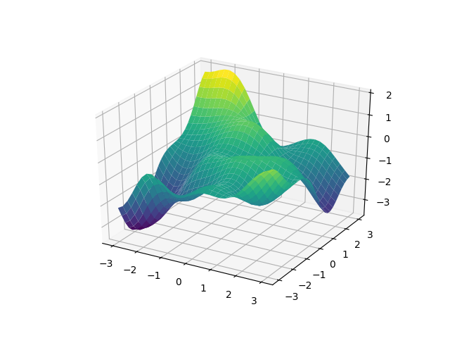
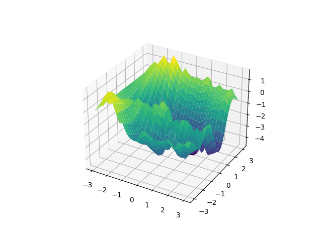
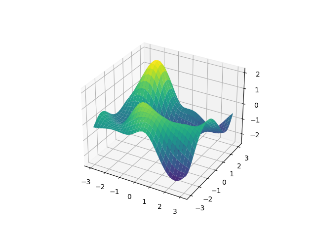

.. currentmodule:: lsqfitgp

.. _multiin:

Multidimensional input
======================

:mod:`lsqfitgp` supports multidimensional input through `numpy structured
arrays <https://numpy.org/doc/stable/user/basics.rec.html>`_. Elements of
structured arrays have named fields. Easier done than said::

    import numpy as np
    
    x = np.linspace(-3, 3, 30)
    y = np.linspace(-3, 3, 30)
    
    xy = np.empty((len(x), len(y)), dtype=[('x', float), ('y', float)])
    xy['x'] = x[:, None]
    xy['y'] = y[None, :]

Here we used a bit of Numpy indexing and broadcasting to fill a 30x30 array
``xy`` with a grid of x, y coordinates. Let's look at it in order. We specified
a data type ``[('x', float), ('y', float)]`` for the array ``xy``, this means
that each element of ``xy`` is a pair of numbers. We specified a shape
``(len(x), len(y))``, where ``x`` and ``y`` are the two linspaces, and then
filled separately the ``'x'`` and ``'y'`` fields of the ``xy`` elements with
the linspaces. ``xy`` is a 2D array, while ``x`` and ``y`` are 1D, so using
``None`` we added a dummy dimension along which the copying is repeated. The
colons ``:`` are empty slices and leave the dimension untouched.

It is not important for ``xy`` to be a 2D array because we are using
bidimensional points, it is just a convenience for building a rectangular grid.
Do not confuse the number of dimensions of the array with the number of fields
in its elements.

A thing to notice is that we only used 30 points for the side of the grid. This
is because 30x30 = 900 and at around 1000 datapoints :mod:`lsqfitgp` starts
being slow. This is an inherent limitation of gaussian processes, which can be
only overcome with approximations or specialized algorithms. If you need to
handle a lot of datapoints, `pymc3
<https://docs.pymc.io/notebooks/GP-Kron.html>`_ has some support for separable
kernels on grids, while `celerite
<https://celerite.readthedocs.io/en/stable/>`_ implements Fourier kernels in 1D.

Now we put ``xy`` into a :class:`GP` as usual and extract a sample from the
prior. ::

    import lsqfitgp as lgp
    import gvar
    
    gp = lgp.GP(lgp.ExpQuad())
    gp.addx(xy, 'foo')
    
    prior = gp.prior('foo')
    sample = next(gvar.raniter(prior))

We plot the sample following the `matplotlib 3d tutorial
<https://matplotlib.org/tutorials/toolkits/mplot3d.html#sphx-glr-tutorials-toolk
its-mplot3d-py>`_::

    from matplotlib import pyplot as plt
    
    fig = plt.figure('lsqfitgp example')
    fig.clf()
    ax = fig.add_subplot(111, projection='3d')
    
    ax.plot_surface(xy['x'], xy['y'], sample, cmap='viridis')
    
    fig.savefig('in1.png')

We got a nice random surface. The :class:`ExpQuad` kernel just worked out of
the box with multidimensional input. What kernel are we using really?
:class:`ExpQuad` is a subclass of :class:`IsotropicKernel`. This means it only
depends on the distance between points, i.e. it doesn't care what the input is
as long as it can apply Pythagoras' theorem. So the kernel we used is:

.. math::
    k(x_1, y_1, x_2, y_2)
    = \exp \left( -\frac {(x_1 - x_2)^2 + (y_1 - y_2)^2} 2 \right).

We can do more sophisticated things if we control how the kernel acts on each
dimension. Let's use a random walk along :math:`x` and an exponential
quadratic along :math:`y`::

    gp = lgp.GP(lgp.Wiener(dim='x', loc=-3) * lgp.ExpQuad(dim='y'))
    gp.addx(xy, 'foo')
    
    prior = gp.prior('foo')
    sample = next(gvar.raniter(prior))
    
    ax.cla()
    ax.plot_surface(xy['x'], xy['y'], sample, cmap='viridis')
    
    fig.savefig('in2.png')

Uhm, quite unelegant. I don't like random walks any more. We used the ``dim``
keyword to specify the dimension, and ``loc=-3`` to translate the random walk
(it raises an error if it gets negative input points).

In many dimensions it can get tedious to specify all the field names, it would
be simpler if multidimensional input was implemented with arrays. Luckily
:mod:`numpy` supports array data types in fields. Let's redo the first example,
this time without named fields::

    xy = np.empty((len(x), len(y)), dtype=[('foo', float, 2)])
    xy['foo'][..., 0] = x[:, None]
    xy['foo'][..., 1] = y[None, :]

Ok, I lied a bit, there's still a field name around. It is needed because
otherwise :mod:`lsqfitgp` would not know that the last axis with size 2 is a
2-dimensional point instead of a pair of points, so we encapsulate it in a
field. :mod:`numpy` treats the ellipsis ``...`` as a string of colons ``:`` of
the appropriate length. ::

    gp = lgp.GP(lgp.ExpQuad())
    gp.addx(xy, 'foo')
    
    prior = gp.prior('foo')
    sample = next(gvar.raniter(prior))
    
    ax.cla()
    ax.plot_surface(xy['foo'][..., 0], xy['foo'][..., 1], sample, cmap='viridis')
    
    fig.savefig('in3.png')

However, with this method, it is not possible to apply a kernel only along a
specific dimension. A kernel can be applied only on everything or on a single
whole named field. By splitting your dimensions in named fields with different
shapes this should still be flexible enough, nevertheless in a future release I
will introduce support for applying a kernel along any kind of subset of the
dimensions.
