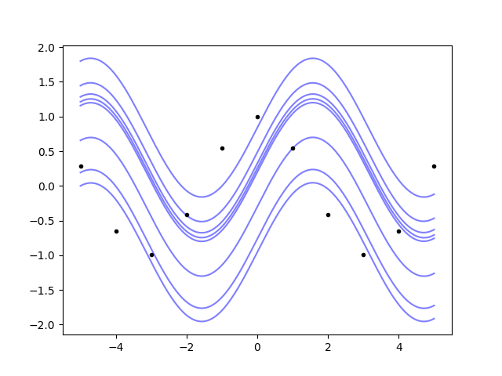
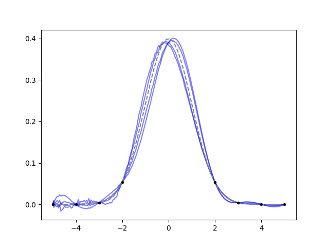

.. lsqfitgp/docs/integrals.rst
..
.. Copyright (c) 2020, 2022, Giacomo Petrillo
..
.. This file is part of lsqfitgp.
..
.. lsqfitgp is free software: you can redistribute it and/or modify
.. it under the terms of the GNU General Public License as published by
.. the Free Software Foundation, either version 3 of the License, or
.. (at your option) any later version.
..
.. lsqfitgp is distributed in the hope that it will be useful,
.. but WITHOUT ANY WARRANTY; without even the implied warranty of
.. MERCHANTABILITY or FITNESS FOR A PARTICULAR PURPOSE.  See the
.. GNU General Public License for more details.
..
.. You should have received a copy of the GNU General Public License
.. along with lsqfitgp.  If not, see <http://www.gnu.org/licenses/>.

.. currentmodule:: lsqfitgp

.. _integrals:

Taking integrals
================

There is no "direct" support for integrals in :mod:`lsqfitgp`. There's not
something like a ``deriv=-1`` option for :meth:`GP.addx`. However, since the
data can be specified for the derivative of the process, it is possible to do
integrals by defining the process for the integral and then fitting its
derivative.

Let's compute the primitive of our dear friend cosine::

    import lsqfitgp as lgp
    import numpy as np
    import gvar
    
    x = np.linspace(-5, 5, 11)
    y = np.cos(x)
    xplot = np.linspace(-5, 5, 200)
    
    gp = lgp.GP(lgp.ExpQuad(scale=2))
    gp.addx(xplot, 'primitive')
    gp.addx(x, 'cosine', deriv=1)
    
    yplot = gp.predfromdata({'cosine': y}, 'primitive')

We just gave the data for the ``'cosine'`` label which has ``deriv=1``, and
asked for the posterior on the label ``'primitive'`` which is not derived. Now
we plot::

    from matplotlib import pyplot as plt
    
    fig, ax = plt.subplots(num='lsqfitgp example')
    
    ax.plot(x, y, '.k')
    for sample in gvar.raniter(yplot, 8):
        ax.plot(xplot, sample, color='blue', alpha=0.5, zorder=-1)
    
    fig.savefig('integrals1.png')

So, the Gaussian process not only can do integrals, it also understands that
the primitive is defined up to an additive constant.

How can we do a definite integral? There's the easy way, and the easy but not
obvious way. Let's go first with the easy one: we use the correlation tracking
features of :mod:`gvar`. ::

    area = yplot[-1] - yplot[0] # -1 means the last index
    print(area)

Output: ``-1.9157(27)``. The ``(27)`` is a short notation for saying that the
standard deviation is 0.0027. Is it correct? Well we know the answer here::

    true_area = np.sin(xplot[-1]) - np.sin(xplot[0])
    print(true_area, area - true_area)

Output: ``-1.917848549326277 0.0022(27)``. So it's correct within one standard
deviation.

The not obvious way follows::

    gp.addlintransf(lambda x: x[-1] - x[0], ['primitive'], 'integral')
    area = gp.predfromdata({'cosine': y}, 'integral')
    print(area)

Output: ``-1.9157(27)``. What did we do? :meth:`~GP.addlintransf` is similar to
:meth:`~GP.addx`, but instead of adding new points where the process is
evaluated, it defines a linear transformation of already specified process
values. The first argument is ``lambda x: x[-1] - x[0]``, a function which
takes in an array and computes the same difference we computed by hand before.
The second argument is ``['primitive']``, a list of labels that indicate which
arrays are passed to the function. The last argument is the name of the newly
defined array of process values, as in :meth:`~GP.addx`.

Using :meth:`~GP.addlintransf` for this is overkill, since transformations
applied to the posterior can always be applied directly to the arrays returned
by :meth:`~GP.predfromdata`. It becomes useful when there's data to fit against
the transformed quantities.

Example: you already know the area of the function. Let's try this with a
Cauchy pdf, pretending we only know its area and some values of the function
not too close to the center::

    from scipy import stats
    
    x = np.array([-5, -4, -3, -2, 2, 3, 4, 5])
    
    true_function = stats.cauchy.pdf
    true_area = np.subtract(*stats.cauchy.cdf([x[-1], x[0]]))
    
    y = true_function(x)
    
    gp = lgp.GP(lgp.ExpQuad(scale=2))
    gp.addx(x, 'datapoints', deriv=1)
    gp.addx(-5, 'left')
    gp.addx(5, 'right')
    gp.addlintransf(lambda l, r: r - l, ['left', 'right'], 'area')
    
    xplot = np.linspace(-5, 5, 200)
    gp.addx(xplot, 'plot', deriv=1)
    
    yplot = gp.predfromdata({'datapoints': y, 'area': true_area}, 'plot')
    
    ax.cla()
    
    m = gvar.mean(yplot)
    s = gvar.sdev(yplot)
    ax.fill_between(xplot, m - s, m + s, alpha=0.5)
    ax.plot(xplot, true_function(xplot), color='gray', linestyle='--')
    ax.plot(x, y, '.k')
    
    fig.savefig('integrals2.png')

It doesn't work too well, the posterior band completely misses the top of the
function, but at least it gets the sides right. This highlights the importance
of the choice of prior. Try playing with changing the kernel and its parameters
too see if you can find a prior that "likes" the Cauchy pdf enough to reproduce
it given the constraints.
