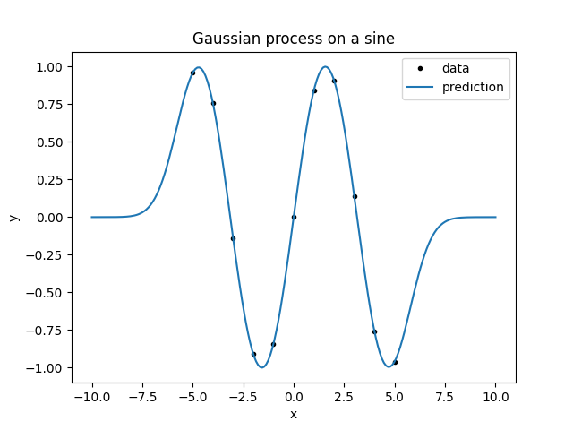
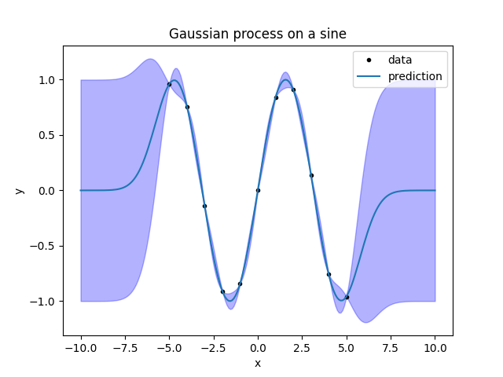

Introduction
============

This module provides a simple but powerful interface to use gaussian processes
for fitting.

Briefly, gaussian processes are a statistical tool for fitting unknown
functions. If you want to know more about gaussian processes, the book
`Gaussian Processes for Machine Learning <http://gaussianprocess.org/gpml/>`_
is a good reference available for free. However, understanding the technical
details is not necessary to use the basic functionality of the module.

We will now go through a very simple example fit to introduce how the module
works. First, import the modules::

    import lsqfitgp as lgp
    import numpy as np
    import gvar

I suppose you know about ``numpy``, but you may not know about ``gvar``. It is
a module for automatic linear correlation tracking. We will se how to use it in
the example, if you want to know more `it has a good documentation
<https://gvar.readthedocs.io/en/latest/>`_.

Now we generate some fake data. Let's make a sine::

    x = np.linspace(-5, 5, 11) # 11 numbers uniformly spaced from -5 to 5
    y = np.sin(x)

We won't add errors to the data for now. What we are going to do in the next
steps is pretending we don't know the data comes from a sine, and letting the
fit guess a function that passes through the data.

The first step in using a gaussian process is choosing a *kernel function*. Say
:math:`f` is the unknown function we want to model. The kernel function
:math:`k(x, y)` specifies the covariance we expect *a priori* between
:math:`f(x)` and :math:`f(y)`:

.. math::
    k(x, y) = \operatorname{Cov}[f(x), f(y)].

This means that the *a priori* variance of :math:`f(x)` is
:math:`\operatorname{Var}[f(x)] = k(x, x)`, and the *a priori* correlation
between :math:`f(x)` and :math:`f(y)` is

.. math::
    \operatorname{Corr}[f(x), f(y)] &=
    \frac {\operatorname{Cov}[f(x), f(y)]}
          {\sqrt{\operatorname{Var}[f(x)] \operatorname{Var}[f(y)]}} = \\
    &= \frac {k(x, y)} {\sqrt{k(x, x) k(y, y)}}.

Again, in other words: :math:`\sqrt{k(x, x)}` expresses how much you are
uncertain on the function value at :math:`x` before seeing the data, and
:math:`k(x, y)` expresses how much you think the value at point :math:`x` is
linked with the value at point :math:`y`.

``lsqfitgp`` allows you to specify arbitrary functions as kernels; however, not
all functions are valid kernels, so it is convenient to use one of the already
available ones from the module. We will use a quite common kernel, the
*exponential quadratic*:

.. math::
    k(x, y) = \exp \left( \frac 12 (x - y)^2 \right)

which is available as :class:`~lsqfitgp.ExpQuad`::

    kernel = lgp.ExpQuad()

Note the parentheses: :class:`~lsqfitgp.ExpQuad` is a class, and we create an
instance by calling it.

Now we build a :class:`GP` object, providing as argument the kernel we want to
use, and tell it we want to evaluate the process on the array of points ``x``
we created before::

    gproc = lgp.GP(kernel)
    gproc.addx(x, 'foo')

So, we add points using the :meth:`addx` method of :class:`GP` objects. It
won't be very useful to only ask for the process values on the data---we
already know the answer there---so we add another array of points, more finely
spaced, and more extended::

    xpred = np.linspace(-10, 10, 200)
    gproc.addx(xpred, 'bar')

When adding ``x`` and ``xpred``, we also provided two strings to
:meth:`addx`, ``'foo'`` and ``'bar'``. These have no special meaning, they
are just labels the :class:`GP` object uses to distinguish the various arrays
you add to it. You can think of them as variable names.

Now, we ask ``gproc`` to compute the *a posteriori* function values on
``xpred`` by using the known values on ``x``::

    ypred = gproc.predfromdata({'foo': y}, 'bar')

So :meth:`predfromdata` takes two arguments; the first is a Python dictionary
with labels as keys and arrays of function values as values, the second is the
label on which we want the estimate.

Now we make a plot of everything::

    from matplotlib import pyplot as plt
    
    fig = plt.figure('lsqfitgp example')
    fig.clf()
    
    ax = fig.subplots(1, 1)
    ax.set_title('Gaussian process on a sine')
    ax.set_xlabel('x')
    ax.set_ylabel('y')
    
    ax.plot(x, y, marker='.', linestyle='', color='black', label='data')
    
    ypred_mean = gvar.mean(ypred)
    ax.plot(xpred, ypred_mean, label='prediction')
    
    ax.legend()
    
    fig.savefig('introduction1.png')

Notice that, to plot ``ypred``, we did ``ypred_mean = gvar.mean(ypred)``. This
is because the output of ``predfromdata`` is not an array of numbers, but an
array of :class:`gvar.GVar` objects. :class:`GVar` variables represent gaussian
distributions; :meth:`gvar.mean` extracts the mean of the distribution. Let's
make an error band for the fit by computing the standard deviations with
:meth:`gvar.sdev`::

    ypred_sdev = gvar.sdev(ypred)
    bottom = ypred_mean - ypred_sdev
    top = ypred_mean + ypred_sdev
    ax.fill_between(xpred, bottom, top, alpha=0.3, color='blue')
    
    fig.savefig('introduction2.png')

TO BE COMPLETED
