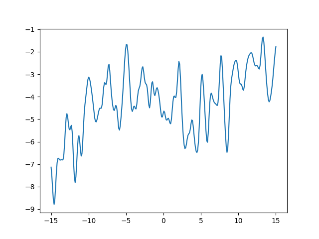
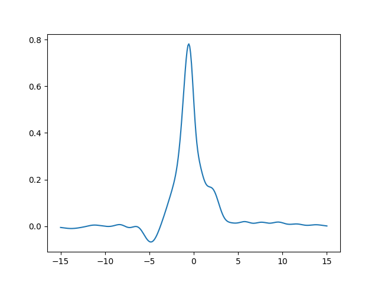
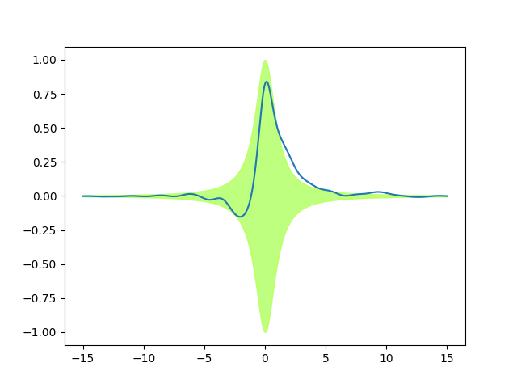

.. lsqfitgp/docs/kernels.rst
..
.. Copyright (c) 2020, 2022, Giacomo Petrillo
..
.. This file is part of lsqfitgp.
..
.. lsqfitgp is free software: you can redistribute it and/or modify
.. it under the terms of the GNU General Public License as published by
.. the Free Software Foundation, either version 3 of the License, or
.. (at your option) any later version.
..
.. lsqfitgp is distributed in the hope that it will be useful,
.. but WITHOUT ANY WARRANTY; without even the implied warranty of
.. MERCHANTABILITY or FITNESS FOR A PARTICULAR PURPOSE.  See the
.. GNU General Public License for more details.
..
.. You should have received a copy of the GNU General Public License
.. along with lsqfitgp.  If not, see <http://www.gnu.org/licenses/>.

.. currentmodule:: lsqfitgp

.. _kernelexpl:

More on kernels
===============

In :ref:`sine`, we defined the kernel as the function that gives the covariance
of the process values at two different points:

.. math::
    k(x, x') = \operatorname{Cov}[f(x), f(x')].

So you can imagine the Gaussian process as a multivariate Gaussian distribution
on an infinitely long vector :math:`f(x)`, where :math:`x` is a "continuous
index", and :math:`k(x, x')` is the covariance matrix.

This implies that kernels are symmetric, i.e., :math:`k(x, x') = k(x', x)`.
Also, covariance matrices must be positive semidefinite (if you wonder why, you
can find an explanation on `wikipedia
<https://en.wikipedia.org/wiki/Covariance_matrix#Which_matrices_are_covariance_m
atrices?>`_). For kernels, this means that, for *any* function :math:`g`,

.. math::
    \int_{-\infty}^\infty \mathrm dx \mathrm dx'\, g(x) k(x, x') g(x') \ge 0.

This is the reason why you can't pick any two-variable symmetric function as
kernel. So, how do you build valid kernels? Luckily, there are some simple
rules that allow to make kernels out of other kernels:

* The sum of kernels is a kernel.

* The product of kernels is a kernel.

* Corollary 1: a kernel can be multiplied by a nonnegative constant.

* Corollary 2: a kernel can be raised to an integer power (some kernels
  allow non-integer nonnegative powers, they are called "infinitely divisible").

* Corollary 3: a function with nonnegative Taylor coefficients applied to
  some kernels is a valid kernel.

Now we need a set of fundamental kernels to start with. There is a class of
functions that can be easily shown to be positive semidefinite (exercise for
the reader): :math:`k(x, x') = h(x) h(x')` for some function :math:`h`. In
fact, it can be shown that *any* kernel can be written as

.. math::
    k(x, x') = \sum_i h_i(x) h_i(x')

for some possibly infinite set of functions :math:`\{h_i\mid i=0,1,\ldots\}`.

Ok, but if I use a kernel of the form :math:`h(x) h(x')`, how will it behave
in practice with the data?

Let's suppose that you have some data :math:`y(x)` that you want to fit with
a specific function, that (let's say by chance) we call :math:`h(x)`, apart
from an amplitude parameter, i.e., the model is

.. math::
    y = p h(x) + \varepsilon(x),

where :math:`\varepsilon(x)` is an independent zero mean Gaussian distributed
error. Put a Gaussian prior with zero mean and unit variance on the parameter
:math:`p`. What is the prior covariance of :math:`y(x)` with :math:`y(x')`?
Let's compute:

.. math::
    \operatorname{Cov}[y(x), y(x')] &=
    \operatorname{Cov}[p h(x) + \varepsilon(x), p h(x') + \varepsilon(x')] = \\
    &= \operatorname{Var}[p] h(x) h(x') = \\
    &= h(x) h(x').

This, by definition, is also the prior of a Gaussian process fit with kernel
:math:`h(x) h(x')`. It can be extended to :math:`y = \sum_i p_i h_i(x)` to get
the general kernel from above (exercise). So, have we discovered that a
Gaussian process fit is just a linear least squares fit with priors? Yes! But,
when thinking in terms of Gaussian processes, you normally use an infinite
set of functions :math:`h_i`. You don't even think about it in terms of the
:math:`h_i`, because the kernel has meaning in itself.

Let's now build some feeling for how kernels behave. In :ref:`sine` we always
used the :class:`ExpQuad` kernel (booring). To start, we will sum two
exponential quadratic kernels with different scales, and see what happens::

    import lsqfitgp as lgp
    import numpy as np
    import gvar
    from matplotlib import pyplot as plt
    
    kernel = lgp.ExpQuad(scale=0.3)
    kernel += 3**2 * lgp.ExpQuad(scale=10) # we also multiply the scale=10
                                           # kernel to see it better
    gp = lgp.GP(kernel)
    
    x = np.linspace(-15, 15, 300)
    gp.addx(x, 'baz')
    
    fig, ax = plt.subplots(num='lsqfitgp example')
    
    y = gp.prior('baz')
    for sample in gvar.raniter(y, 1):
        ax.plot(x, sample)
    
    fig.savefig('kernels1.png')

First thing to notice, we introduced another :class:`GP` method:
:meth:`~GP.prior`. It returns an array of :class:`GVar` variables representing
the prior. In general it is useful to plot some samples from the prior to
understand if the kernel makes sense before putting the data in.

Looking at the plot, we see the function oscillates rapidly, but the center of
the oscillation drifts. Effectively, if you think about it, summing two kernels
is like summing two *independent* Gaussian processes: let :math:`f_1` and
:math:`f_2` be processes with kernels :math:`k_1` and :math:`k_2` respectively,
then the kernel of :math:`f_1 + f_2` is

.. math::
    k(x, x') &= \operatorname{Cov}[f_1(x) + f_2(x), f_1(x) + f_2(x')] = \\
            &= \operatorname{Cov}[f_1(x), f_1(x')] +
               \operatorname{Cov}[f_2(x), f_2(x')] = \\
            &= k_1(x, x') + k_2(x, x').

So we are looking at the sum of two processes, one ``ExpQuad(scale=0.3)``
and one ``ExpQuad(scale=10)``.

Let's now multiply kernels. The :math:`h(x)h(x')` kernel is implemented in
:mod:`lsqfitgp` as :class:`Rescaling`. We multiply it by an exponential
quadratic::

    lorentz = lambda x: 1 / (1 + x**2)
    kernel = lgp.ExpQuad() * lgp.Rescaling(stdfun=lorentz)
    gp = lgp.GP(kernel)
    gp.addx(x, 'baz')
    
    ax.cla()
    
    y = gp.prior('baz')
    sample = next(gvar.raniter(y, 1))
    ax.plot(x, sample)
    
    fig.savefig('kernels2.png')

The function oscillates, but the oscillations are suppressed going away from
zero. This is because the function we defined, ``lorentz``, goes to zero for
:math:`x\to\pm\infty`. Let's plot a band delimited by :math:`\pm` that
function (cyan), and the band of the standard deviation of ``y`` (yellow)::

    ax.fill_between(x, -lorentz(x), lorentz(x), color='cyan', alpha=0.5)
    ax.fill_between(x, -gvar.sdev(y), gvar.sdev(y), color='yellow', alpha=0.5)
    
    fig.savefig('kernels3.png')

We see only one green (cyan+yellow) band, because it is a perfect match! We
have rescaled the standard deviations of the prior with the function
``lorentz``, without changing the correlations. Since the :class:`ExpQuad`
prior variance is 1 everywhere, after the multiplication it just matches
``lorentz(x)``.
