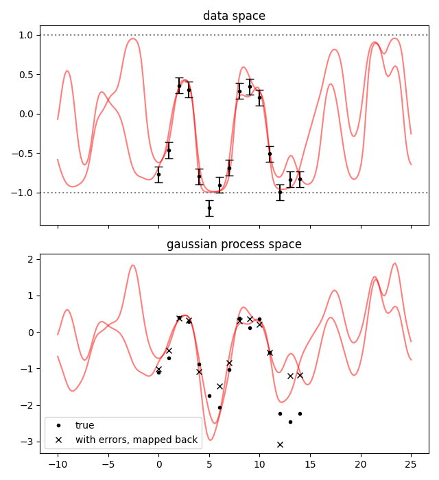

.. lsqfitgp/docs/nonlinear.rst
..
.. Copyright (c) 2020, 2022, Giacomo Petrillo
..
.. This file is part of lsqfitgp.
..
.. lsqfitgp is free software: you can redistribute it and/or modify
.. it under the terms of the GNU General Public License as published by
.. the Free Software Foundation, either version 3 of the License, or
.. (at your option) any later version.
..
.. lsqfitgp is distributed in the hope that it will be useful,
.. but WITHOUT ANY WARRANTY; without even the implied warranty of
.. MERCHANTABILITY or FITNESS FOR A PARTICULAR PURPOSE.  See the
.. GNU General Public License for more details.
..
.. You should have received a copy of the GNU General Public License
.. along with lsqfitgp.  If not, see <http://www.gnu.org/licenses/>.

.. currentmodule:: lsqfitgp

.. _nonlinear:

Nonlinear models
================

Using :class:`GP` we can define a gaussian process. Using :meth:`GP.addtransf`
we can represent finite linear transformations of the process, and we can take
derivatives with :meth:`GP.addx`. This means that we can only do linear
operations on the process before putting the data in.

A common non-linear operation is putting a boundary on the possible data
values. Gaussian distributions don't play nicely with boundaries---they are
defined on :math:`(-\infty,\infty)`---so it is necessary to map the gaussian
process space to an interval with a nonlinear function.

:mod:`lsqfitgp` is designed to work with the general purpose fitting module
:mod:`lsqfit` (after which it takes the name) for this kind of situations. If
you want to know more, it has a `good documentation
<https://lsqfit.readthedocs.io/en/latest/index.html>`_.

Let's see how to fit some data that is constrained in (-1, 1). To map the
gaussian process space to the data space, we'll use an hyperbolic tangent.
It has the properties :math:`\tanh(\pm\infty) = \pm 1`, :math:`\tanh'(0) = 1`,
:math:`\tanh(-x) = -\tanh(x)`.

We first define a gaussian process as usual and take a sample from it as fake
data. ::

    import lsqfitgp as lgp
    import numpy as np
    import gvar
    
    gp = lgp.GP(lgp.ExpQuad())
    
    x = np.arange(15)
    gp.addx(x, 'data')
    
    data_gp = next(gvar.raniter(gp.prior('data')))

Then we map it to (-1, 1)::

    data = np.tanh(data_gp)

Now we'll add errors to the data. If data does not have errors, there's not
really a problem to start with: you can map the data to :math:`(-\infty,
\infty)` with :func:`np.arctanh`, do the gaussian process fit, take some
samples, map the samples back with :func:`np.tanh`.

You may do that even with errors, either at first order using
:func:`gvar.arctanh`, or by transforming the errors manually yourself. However,
in that way you would be doing a fit with gaussian errors on the transformed
data. What we will do is a fit with gaussian errors on the data itself. Another
case we won't explore in which just transforming the data before the fit is not
sufficient is when the mapping between the gaussian process and the data
depends on a fit parameter. ::

    err = 0.1
    data += err * np.random.randn(len(data))
    data = gvar.gvar(data, np.full_like(data, err))

We then prepare a :class:`GP` object for the fit::

    gp = lgp.GP(lgp.ExpQuad())
    gp.addx(x, 'data')
    
    xplot = np.linspace(-10, 25, 200)
    gp.addx(xplot, 'plot')

Now we define the prior and model function following the requirements of
:class:`lsqfit.nonlinear_fit` and run the fit::

    import lsqfit
    
    prior = {
        'gproc': gp.prior('data')
    }
    
    def fcn(params):
        return gvar.tanh(params['gproc'])
    
    fit = lsqfit.nonlinear_fit(data=data, fcn=fcn, prior=prior)
    print(fit.format(maxline=True))

Output::

   Least Square Fit:
     chi2/dof [dof] = 1.1 [15]    Q = 0.37    logGBF = -7.9817

   Parameters:
           gproc 0   -0.97 (22)     [  0.0 (1.0) ]  
                 1   -0.50 (12)     [  0.0 (1.0) ]  
                 2    0.37 (11)     [  0.0 (1.0) ]  
                 3    0.31 (11)     [  0.0 (1.0) ]  
                 4   -1.05 (24)     [  0.0 (1.0) ]  *
                 5   -1.97 (56)     [  0.0 (1.0) ]  *
                 6   -1.59 (47)     [  0.0 (1.0) ]  *
                 7   -0.79 (17)     [  0.0 (1.0) ]  
                 8    0.28 (11)     [  0.0 (1.0) ]  
                 9    0.37 (11)     [  0.0 (1.0) ]  
                10    0.20 (10)     [  0.0 (1.0) ]  
                11   -0.56 (13)     [  0.0 (1.0) ]  
                12   -1.47 (37)     [  0.0 (1.0) ]  *
                13   -1.26 (32)     [  0.0 (1.0) ]  *
                14   -1.09 (26)     [  0.0 (1.0) ]  *

   Fit:
         key        y[key]      f(p)[key]
   --------------------------------------
           0    -0.77 (10)    -0.749 (95)  
           1    -0.46 (10)    -0.459 (97)  
           2     0.36 (10)     0.352 (98)  
           3     0.30 (10)     0.296 (98)  
           4    -0.80 (10)    -0.783 (93)  
           5    -1.20 (10)    -0.962 (42)  **
           6    -0.90 (10)    -0.921 (71)  
           7    -0.69 (10)    -0.657 (96)  
           8     0.29 (10)     0.268 (98)  
           9     0.34 (10)     0.350 (97)  
          10     0.20 (10)     0.198 (98)  
          11    -0.51 (10)    -0.512 (97)  
          12    -1.00 (10)    -0.899 (71)  
          13    -0.83 (10)    -0.851 (87)  
          14    -0.83 (10)    -0.798 (95)  

   Settings:
     svdcut/n = 1e-12/0    tol = (1e-08,1e-10,1e-10*)    (itns/time = 29/0.2)
     fitter = scipy_least_squares    method = trf

Let's plot everything. First we compute the posterior on the `xplot` points,
and inject it into a copy of the fit result dictionary::

    gpplot = gp.predfromfit({'data': fit.p['gproc']}, 'plot')
    fitp = dict(fit.p)
    fitp['gproc'] = gpplot

This copy-and-replace step is a bit redundant here, it is for when there are
also other parameters beside the gaussian process. Then we plot both the data
space and the gaussian process space. ::

    from matplotlib import pyplot as plt
    
    fig = plt.figure('lsqfitgp example')
    fig.clf()
    fig.set_size_inches(6.4, 7)
    axs = fig.subplots(2, 1, sharex=True)
    
    for sample in gvar.raniter(fitp, 2):
        axs[0].plot(xplot, fcn(sample), color='red', alpha=0.5)
        axs[1].plot(xplot, sample['gproc'], color='red', alpha=0.5)
    
    ax = axs[0]
    ax.set_title('data space')
    for boundary in 1, -1:
        ax.axhline(boundary, color='gray', linestyle=':')
    ax.errorbar(x, gvar.mean(data), yerr=gvar.sdev(data), fmt='.k', capsize=4)
    
    ax = axs[1]
    ax.set_title('gaussian process space')
    ax.plot(x, data_gp, '.k', label='true')
    ax.plot(x, np.arctanh(gvar.mean(data)), 'xk', label='with errors, mapped back')
    ax.legend()
    
    fig.tight_layout()
    fig.savefig('nonlinear1.png')

The thing to notice here is that, in the gaussian process space, the samples
can get quite far from the points. This is because the nonlinear mapping
stretches the space near the boundaries. However, in the data space they look
fine: this is because we did the fit in the data space.
