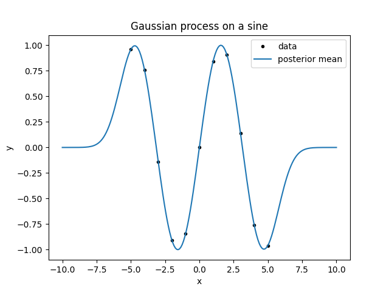
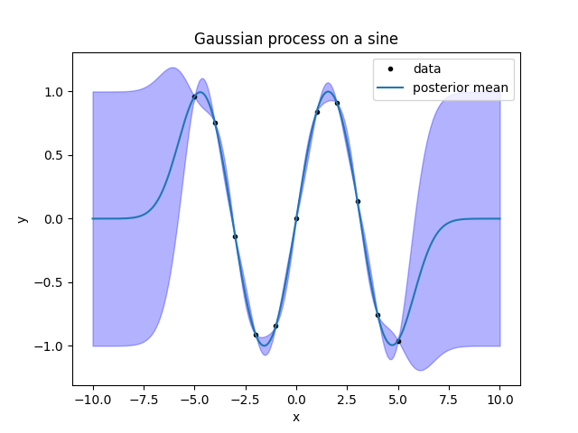
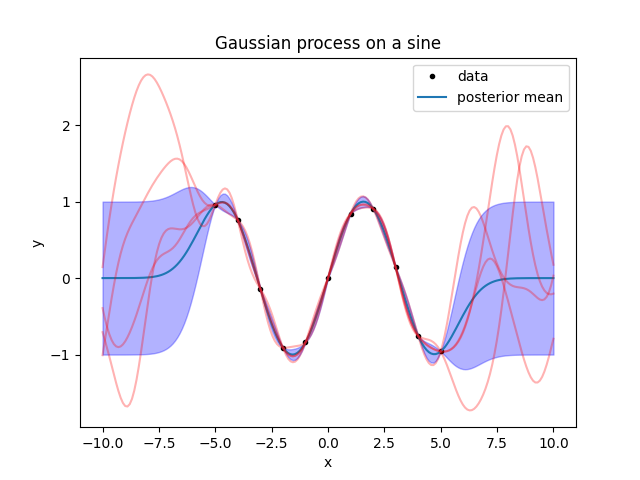
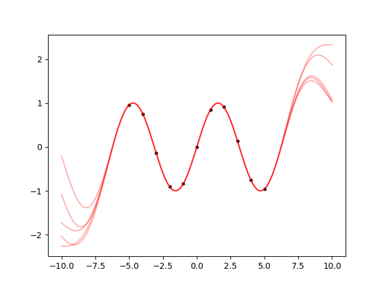
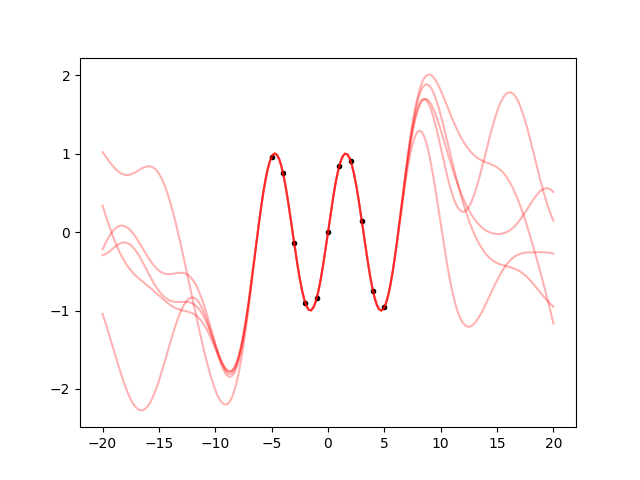
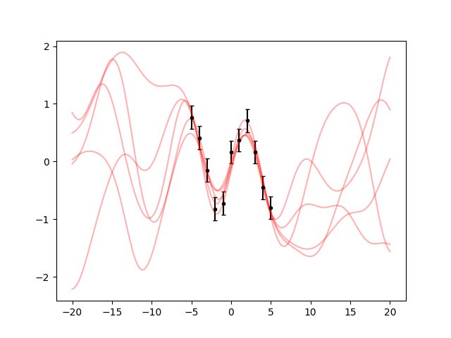

.. lsqfitgp/docs/sine.rst
..
.. Copyright (c) Giacomo Petrillo 2020
..
.. This file is part of lsqfitgp.
..
.. lsqfitgp is free software: you can redistribute it and/or modify
.. it under the terms of the GNU General Public License as published by
.. the Free Software Foundation, either version 3 of the License, or
.. (at your option) any later version.
..
.. lsqfitgp is distributed in the hope that it will be useful,
.. but WITHOUT ANY WARRANTY; without even the implied warranty of
.. MERCHANTABILITY or FITNESS FOR A PARTICULAR PURPOSE.  See the
.. GNU General Public License for more details.
..
.. You should have received a copy of the GNU General Public License
.. along with lsqfitgp.  If not, see <http://www.gnu.org/licenses/>.

.. currentmodule:: lsqfitgp

.. _sine:

First example: a sine
=====================

We will go through a very simple example fit to introduce how the module works.
First, import the modules::

    import lsqfitgp as lgp
    import numpy as np
    import gvar

I suppose you know about :mod:`numpy`, but you may not know about :mod:`gvar`.
It is a module for automatic linear correlation tracking. We will se how to use
it in the example, if you want to know more `it has a good documentation
<https://gvar.readthedocs.io/en/latest/>`_.

Now we generate some fake data. Let's make a sine::

    x = np.linspace(-5, 5, 11) # 11 numbers uniformly spaced from -5 to 5
    y = np.sin(x)

We won't add errors to the data for now. What we are going to do in the next
steps is pretending we don't know the data comes from a sine, and letting the
fit guess a function that passes through the data.

The first step in using a gaussian process is choosing a *kernel function*. Say
:math:`f` is the unknown function we want to model. The kernel function
:math:`k(x, y)` specifies the covariance we expect *a priori* between
:math:`f(x)` and :math:`f(y)`:

.. math::
    k(x, y) = \operatorname{Cov}[f(x), f(y)].

This means that the *a priori* variance of :math:`f(x)` is
:math:`\operatorname{Var}[f(x)] = k(x, x)`, and the *a priori* correlation
between :math:`f(x)` and :math:`f(y)` is

.. math::
    \operatorname{Corr}[f(x), f(y)] &=
    \frac {\operatorname{Cov}[f(x), f(y)]}
          {\sqrt{\operatorname{Var}[f(x)] \operatorname{Var}[f(y)]}} = \\
    &= \frac {k(x, y)} {\sqrt{k(x, x) k(y, y)}}.

Again, in other words: :math:`\sqrt{k(x, x)}` expresses how much you are
uncertain on the function value at :math:`x` before seeing the data, and
:math:`k(x, y)` expresses how much you think the value at point :math:`x` is
linked with the value at point :math:`y`.

:mod:`lsqfitgp` allows you to specify arbitrary functions as kernels; however,
not all functions are valid kernels, so it is convenient to use one of the
already available ones from the module. We will use a quite common kernel, the
*exponential quadratic*:

.. math::
    k(x, y) = \exp \left( \frac 12 (x - y)^2 \right)

which is available as :class:`ExpQuad`::

    kernel = lgp.ExpQuad()

Note the parentheses: :class:`ExpQuad` is a class, and we create an instance by
calling it.

Now we build a :class:`GP` object, providing as argument the kernel we want to
use, and tell it we want to evaluate the process on the array of points ``x``
we created before::

    gproc = lgp.GP(kernel)
    gproc.addx(x, 'foo')

So, we add points using the :meth:`~GP.addx` method of :class:`GP` objects. It
won't be very useful to only ask for the process values on the data---we
already know the answer there---so we add another array of points, more finely
spaced, and more extended::

    xpred = np.linspace(-10, 10, 200)
    gproc.addx(xpred, 'bar')

When adding ``x`` and ``xpred``, we also provided two strings to
:meth:`~GP.addx`, ``'foo'`` and ``'bar'``. These have no special meaning, they
are just labels the :class:`GP` object uses to distinguish the various arrays
you add to it. You can think of them as variable names.

Now, we ask ``gproc`` to compute the *a posteriori* function values on
``xpred`` by using the known values on ``x``::

    ypred = gproc.predfromdata({'foo': y}, 'bar')

So :meth:`~GP.predfromdata` takes two arguments; the first is a Python
dictionary with labels as keys and arrays of function values as values, the
second is the label on which we want the estimate.

Now we make a plot of everything::

    from matplotlib import pyplot as plt
    
    fig = plt.figure('lsqfitgp example')
    fig.clf()
    
    ax = fig.subplots(1, 1)
    ax.set_title('Gaussian process on a sine')
    ax.set_xlabel('x')
    ax.set_ylabel('y')
    
    ax.plot(x, y, marker='.', linestyle='', color='black', label='data')
    
    ypred_mean = gvar.mean(ypred)
    ax.plot(xpred, ypred_mean, label='posterior mean')
    
    ax.legend()
    
    fig.savefig('sine1.png')

Notice that, to plot ``ypred``, we did ``ypred_mean = gvar.mean(ypred)``. This
is because the output of :meth:`~GP.predfromdata` is not an array of numbers,
but an array of :class:`gvar.GVar` objects. :class:`GVar` variables represent
gaussian distributions; :func:`gvar.mean` extracts the mean of the
distribution. Let's make an error band for the fit by computing the standard
deviations with :func:`gvar.sdev`::

    ypred_sdev = gvar.sdev(ypred)
    bottom = ypred_mean - ypred_sdev
    top = ypred_mean + ypred_sdev
    ax.fill_between(xpred, bottom, top, alpha=0.3, color='blue')
    
    fig.savefig('sine2.png')

Let's take a moment to look at the result. First, consider the line giving the
mean. Between the data points, it goes smoothly from one point to the next. It
reasonably approximates a sine. However, outside the region with the data it
goes to zero. This is about a thing I forgot to mention when introducing
kernels: apart from the variance and correlations, a gaussian process also has
an a priori mean. :mod:`lsqfitgp` always assumes that the a priori mean is
zero, so, going far from the data, the a posteriori mean should go to zero too.

It would be easy to provide an arbitrary prior mean by first subtracting it
from the data, and then adding it back to the result. However, I encourage the
reader to avoid using prior means at all while learning gaussian processes. You
should always think about the links and correlations between the points and the
general properties of the function instead of focusing on what value or
specific functional form you expect, and let the data choose the values and
shape.

Now we look at the band. It is a band of :math:`\pm1\sigma` around the
posterior mean (:math:`\sigma` stands conventionally for the standard
deviation). For the gaussian distribution, this interval has a probability of
68 %. A :math:`\pm2\sigma` interval would have a probability of 95 %, so this
means that the fit expects the function to stay most of the time within a band
twice as large as that plotted, and 2/3 of the time inside the one plotted. So,
the summary of the figure is this: close to the points, the function is
probably a sine; as soon as we move out from the datapoints, the fit gives up
and just returns the prior.

Instead of trying to interpret what functions the fit result is representing,
we can write a code to sample some plausible functions from the posterior
distribution. :mod:`gvar` has a function for doing that, :func:`gvar.raniter`::

    for ypred_sample in gvar.raniter(ypred, 4):
        ax.plot(xpred, ypred_sample, color='red', alpha=0.3)
    
    fig.savefig('sine3.png')

What do we learn from this? First, the sampled functions are a bit uglier than
the mean line, even between the datapoints. To have a clear idea of the result,
you should always plot some samples instead of looking at the mean.

Second, outside the datapoints the sampled functions oscillate with peaks that
are a bit too narrow compared to the peaks of the sine. This is invisible by
looking at the error band, so again: to have a clear idea of the result, plot
some samples instead of looking at the error band.

Now, to try to get a smooth fit, we want to increase the "wavelength" of the
kernel to match that of the sine. To do that, we just need to rescale the
input points prior to feeding them to the kernel. We could do that by hand by
multiplying ``x`` and ``xpred`` by something, but all :class:`Kernel` objects
provide a convenient parameter to do that automatically, ``scale``. So
let's do everything again, rescaling by a factor of 3::

    gp = lgp.GP(lgp.ExpQuad(scale=3))
    gp.addx(x, 'foo')
    gp.addx(xpred, 'bar')
    ypred = gp.predfromdata({'foo': y}, 'bar')
    
    ax.cla() # clear the plot
    
    ax.plot(x, y, '.k')
    for sample in gvar.raniter(ypred, 5):
        ax.plot(xpred, sample, 'r', alpha=0.3)
    
    fig.savefig('sine4.png')

This is a bit more similar to the sine. Between the datapoints, the samples
all follow the same path, and they continue to oscillate in a reasonable way
also outside from the datapoints. But what further away? Let's make a plot
from -20 to 20::

    gp = lgp.GP(lgp.ExpQuad(scale=3))
    gp.addx(x, 'foo')
    
    xpred_long = np.linspace(-20, 20, 200)
    gp.addx(xpred_long, 'bar')
    
    ypred = gp.predfromdata({'foo': y}, 'bar')
    
    ax.cla()
    
    ax.plot(x, y, '.k')
    for sample in gvar.raniter(ypred, 5):
        ax.plot(xpred_long, sample, 'r', alpha=0.3)
    
    fig.savefig('sine5.png')

So, after a an oscillation, it still goes back to the prior, as it should. It
just goes on 3 times as much as before because we set ``scale=3``.

Finally, for completeness, let's see how to add errors to the data. First, we
generate some gaussian distributed errors with standard deviation 0.2::

    yerr = 0.2 * np.random.randn(len(y))
    y += yerr

Then, we build an array of :class:`GVar` variables from ``y``::

    gy = gvar.gvar(y, 0.2 * np.ones(len(y)))

Now ``gy`` represents an array of independent gaussian distributions with mean
``y`` and standard deviation 0.2. We then repeat everything as before, but
using ``gy`` instead of ``y``; we don't even need to recreate the :class:`GP`
object because we are not modifying the :math:`x` points::

    ypred = gp.predfromdata({'foo': gy}, 'bar')
    
    ax.cla()
    
    ax.errorbar(x, gvar.mean(gy), yerr=gvar.sdev(gy), fmt='.k', capsize=2)
    for sample in gvar.raniter(ypred, 5):
        ax.plot(xpred_long, sample, 'r', alpha=0.3)
    
    fig.savefig('sine6.png')

The behaviour makes sense: the samples are not forced any more to pass strictly
on the datapoints.

You should now know all the basics. You can experiment using other kernels, the
available ones are listed in the :ref:`kernels`.
